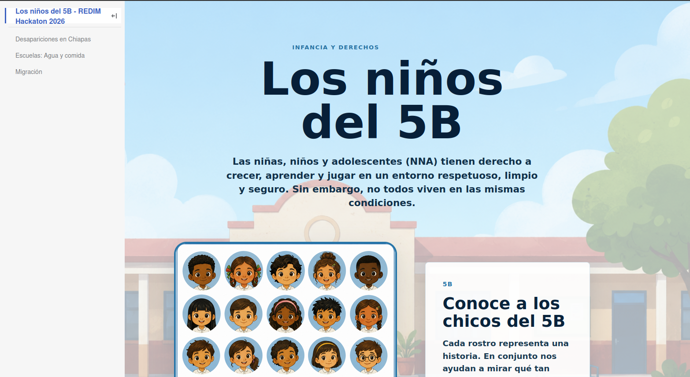

# Hackatón 2026: Los niños del 5B

Entra al enlace para conocer nuestro portal con los retos que enfrentan las niñas, niños y adolescentes en México!

https://hector-garrido.github.io/redim-hackaton-2026/

