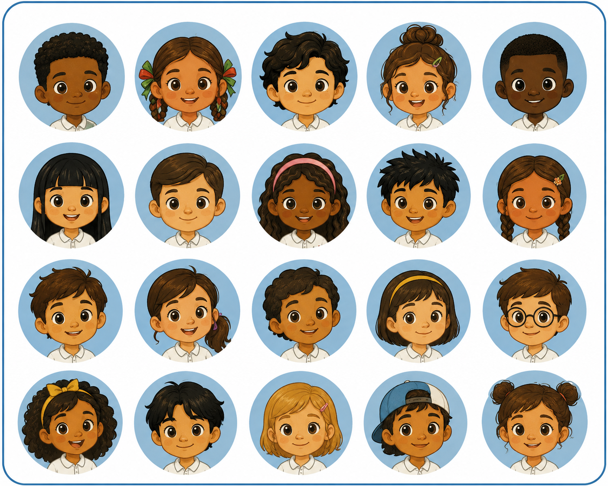

<!-- Main page content: edit the title, intro, and story cards here. -->
<section class="ninos-page">
  <header class="ninos-hero" aria-labelledby="ninos-title">
    <p class="ninos-kicker">Infancia y derechos</p>
    <h1 id="ninos-title">Los niños del 5B</h1>
    <p>
      Las niñas, niños y adolescentes (NNA) tienen derecho a crecer, aprender y jugar en un
      entorno respetuoso, limpio y seguro. Sin embargo, no todos viven en las
      mismas condiciones.
    </p>
  </header>
  <div class="ninos-story" data-story>
    <div class="ninos-visual-wrap">
      <figure class="ninos-visual" aria-label="Grupo de niñas y niños del salón 5B">
        
        <!-- These 20 spans are the circular light spots over the 20 portraits. -->
        <div class="ninos-overlay" aria-hidden="true">
          <span></span><span></span><span></span><span></span><span></span>
          <span></span><span></span><span></span><span></span><span></span>
          <span></span><span></span><span></span><span></span><span></span>
          <span></span><span></span><span></span><span></span><span></span>
        </div>
      </figure>
    </div>
    <!-- Each article is one scroll step. Its data-step must match storyCases below. -->
    <div class="ninos-steps">
      <article class="ninos-step" data-step="intro">
        <p class="ninos-count">5B</p>
        <h2>Conoce a los chicos del 5B</h2>
        <p>
          Cada rostro representa una historia. En conjunto nos ayudan a mirar
          qué tan desiguales pueden ser las condiciones de vida dentro de un
          mismo entorno escolar.
        </p>
      </article>
      <article class="ninos-step" data-step="pobreza">
        <p class="ninos-count">9 de cada 20</p>
        <h2>Se encuentra en situación de pobreza</h2>
        <p>
          En su hogar cuentan con pocos ingresos, viven en espacios poco adecuados, se encuentran rezagados en la escuela, y/o no tienen acceso a servicios de salud o seguridad social. De esos 9, 2 de ellos viven en pobreza extrema, bajo condiciones aún más adversas (CONEVAL 2022).
        </p>
      </article>
      <article class="ninos-step" data-step="trabajo">
        <p class="ninos-count">Casi 3 de cada 20</p>
        <h2>Se encuentra trabajando</h2>
        <p>
          Si bien el trabajo es una actividad importante y valiosa en nuestra sociedad, la ley actualmente prohibe el trabajo para menores de 15 años, pues considera que es escencial que los NNA reciban una educación de calidad antes de incorporarse a la fuerza laboral (INEGI 2022, Ley Federal del Trabajo).
        </p>
      </article>
      <article class="ninos-step" data-step="bullying">
        <p class="ninos-count">5 de cada 20</p>
        <h2>Es víctima de bullying</h2>
        <p>
          En la escuela, algunos son aocsados de distintas maneras, ya sea por exclusión, burlas o apodos, agresiones, o presión para hacer cosas que no quieren.
        </p>
      </article>
      <article class="ninos-step" data-step="violencia_psicologica">
        <p class="ninos-count">10 de cada 20</p>
        <h2>Es víctima de agresión psicológica</h2>
        <p>
          La escuela no es el único espacio donde son suscpetibles a agresiones. En otros espacios, como podría ser su casa, pueden llegar a ser regañados y ofendidos constantemente por no cumplir con sus responsabilidades, hacer rudo, o en ocasiones sin motivo alguno. Sin importar la razón, eso no justifica que sean agredidos.
        </p>
      </article>
      <article class="ninos-step" data-step="violencia_fisica">
        <p class="ninos-count">7 de cada 20</p>
        <h2>Es víctima de castigos físicos</h2>
        <p>
          En ocasiones, las agresiones no consisten solo en ofensas, si no que vinen acompañadas de golpes, jaloneos, u otras acciones violentas.
        </p>
      </article>
      <article class="ninos-step" data-step="final">
        <p class="ninos-count">Todos cuentan</p>
        <h2>Conoce sus retos en diferentes contextos</h2>
        <p>
          Da clic a los enlaces en la barra lateral de la izquierda para conocer las diferentes historias y datos sobre NNA que han descubierto los equipos de la REDIM en México.
        </p>
      </article>
    </div>
  </div>
</section>

```js
// Observable needs FileAttachment here so the CSS background image is copied into dist.
const story = document.querySelector("[data-story]")
const overlay = story?.querySelector(".ninos-overlay")
const steps = Array.from(story?.querySelectorAll("[data-step]") ?? [])
const cells = Array.from(overlay?.children ?? [])
const inicioBackground = await FileAttachment("./inicio_background.png").url()

document.documentElement.style.setProperty("--inicio-background", `url("${inicioBackground}")`)

// Flexible parameter: edit these ids to change which portraits light up.
// Portrait ids run left-to-right, top-to-bottom: 1-5, 6-10, 11-15, 16-20.
const storyCases = {
  intro: {yellow: [], blue: []},
  pobreza: {yellow: [2, 17, 12, 1, 19, 10, 7, 16, 13], blue: "rest"},
  trabajo: {yellow: [16, 10, 12], blue: "rest"},
  bullying: {yellow: [8, 3, 6, 1, 5], blue: "rest"},
  violencia_psicologica: {yellow: [14, 11, 4, 8, 2, 3, 18, 9, 1, 12], blue: []},
  violencia_fisica: {yellow: [1, 20, 11, 14, 6, 3, 5], blue: []},
}

// Flexible parameter: portrait centers for src/ninos_grid.png.
// Adjust these percentages only if you replace/crop the grid image.
const portraitPositions = [
  [11.9, 15.5], [31.0, 15.5], [50.1, 15.5], [69.2, 15.5], [88.3, 15.5],
  [11.9, 39.1], [31.0, 39.1], [50.1, 39.1], [69.2, 39.1], [88.3, 39.1],
  [11.9, 62.7], [31.0, 62.7], [50.1, 62.7], [69.2, 62.7], [88.3, 62.7],
  [11.9, 86.1], [31.0, 86.1], [50.1, 86.1], [69.2, 86.1], [88.3, 86.1]
]

// Places each light spot at the corresponding portrait center.
cells.forEach((cell, index) => {
  const [x, y] = portraitPositions[index]
  cell.style.setProperty("--spot-x", `${x}%`)
  cell.style.setProperty("--spot-y", `${y}%`)
})

// Applies the active case: yellow ids light up, "rest" become blue.
function setStoryStep(name) {
  const state = storyCases[name] ?? storyCases.intro
  const yellow = new Set(state.yellow)
  const blue = state.blue === "rest"
    ? new Set(portraitPositions.map((_, index) => index + 1).filter((id) => !yellow.has(id)))
    : new Set(state.blue)

  story.dataset.activeStep = name
  cells.forEach((cell, index) => {
    const id = index + 1
    cell.dataset.tone = yellow.has(id) ? "yellow" : blue.has(id) ? "blue" : "clear"
  })
}

// Watches which text card is centered in the viewport while scrolling.
const observer = new IntersectionObserver((entries) => {
  const visible = entries
    .filter((entry) => entry.isIntersecting)
    .sort((a, b) => b.intersectionRatio - a.intersectionRatio)[0]

  if (visible) setStoryStep(visible.target.dataset.step)
}, {
  rootMargin: "-35% 0px -45% 0px",
  threshold: [0.25, 0.5, 0.75, 1]
})

steps.forEach((step) => observer.observe(step))
setStoryStep("intro")
```

<style>
:root {
  /* Main light colors and intensity. RGB values are written as "R, G, B". */
  --ninos-blue: 255, 255, 255;
  --ninos-yellow: 255, 0, 0;
  --ninos-blue-strength: 0.99;
  --ninos-yellow-strength: 0.99;
  --ninos-spot-size: 16.5%;
}

/* Page background. The image URL comes from the JS variable above. */
html,
body {
  background:
    linear-gradient(rgba(239, 249, 255, 0.54), rgba(255, 249, 236, 0.58)),
    var(--inicio-background) center / cover fixed;
}

.observablehq {
  background: transparent;
  max-width: none;
}

/* Overall page shell. */
.ninos-page {
  background:
    linear-gradient(rgba(239, 249, 255, 0.54), rgba(255, 249, 236, 0.58)),
    var(--inicio-background) center / cover fixed;
  color: #08233b;
  font-family: Inter, ui-sans-serif, system-ui, -apple-system, BlinkMacSystemFont, "Segoe UI", sans-serif;
  margin: -1rem auto 0;
  min-height: 100vh;
  padding: clamp(2rem, 6vw, 5rem) clamp(1rem, 4vw, 4rem) 6rem;
}

/* Top title area. */
.ninos-hero {
  margin: 0 auto clamp(2rem, 6vw, 4.5rem);
  max-width: 850px;
  text-align: center;
}

.ninos-kicker {
  color: #246f9f;
  font-size: 0.82rem;
  font-weight: 800;
  letter-spacing: 0.12em;
  margin: 0 0 0.75rem;
  text-transform: uppercase;
}

.ninos-hero h1 {
  color: #071f38;
  font-size: clamp(3rem, 8vw, 6.5rem);
  font-weight: 900;
  line-height: 0.95;
  margin: 0;
  max-width: none;
}

.ninos-hero p:last-child {
  color: #102f48;
  font-size: clamp(1.05rem, 2vw, 1.35rem);
  font-weight: 650;
  line-height: 1.45;
  margin: 1.5rem auto 0;
  max-width: 720px;
}

/* Two-column scroll story: fixed image left, changing text right. */
.ninos-story {
  align-items: start;
  display: grid;
  gap: clamp(1.25rem, 4vw, 4rem);
  grid-template-columns: minmax(280px, 1.15fr) minmax(260px, 0.85fr);
  margin: 0 auto;
  max-width: 1200px;
}

/* Keeps the portrait grid fixed while the cards scroll. */
.ninos-visual-wrap {
  min-height: 100vh;
  position: sticky;
  top: clamp(1rem, 4vh, 3rem);
}

.ninos-visual {
  background: rgba(255, 255, 255, 0.9);
  border: 4px solid #2775a8;
  border-radius: 28px;
  box-shadow: 0 22px 60px rgba(28, 70, 98, 0.18);
  margin: 0;
  overflow: hidden;
  position: relative;
}

.ninos-visual img {
  aspect-ratio: 1.25;
  display: block;
  height: auto;
  object-fit: cover;
  width: 100%;
}

.ninos-visual::before {
  background: #eef8ff;
  content: "Agrega la imagen como src/ninos-5b-grid.svg";
  display: grid;
  font-size: clamp(1rem, 2vw, 1.35rem);
  font-weight: 800;
  inset: 0;
  min-height: 360px;
  padding: 2rem;
  place-items: center;
  position: absolute;
  text-align: center;
  z-index: -1;
}

.ninos-overlay {
  inset: 0;
  pointer-events: none;
  position: absolute;
}

/* Default hidden light spot. JS sets --spot-x/--spot-y and data-tone. */
.ninos-overlay span {
  aspect-ratio: 1;
  border-radius: 50%;
  left: var(--spot-x);
  mix-blend-mode: multiply;
  opacity: 0;
  position: absolute;
  top: var(--spot-y);
  transform: translate(-50%, -50%) scale(0.94);
  transition: opacity 450ms ease, transform 450ms ease, background-color 450ms ease, box-shadow 450ms ease;
  width: var(--ninos-spot-size);
}

/* Yellow and blue versions of the light spot. */
.ninos-overlay span[data-tone="yellow"] {
  background:
    radial-gradient(circle at 50% 42%, rgba(255, 253, 189, 0.35), rgba(var(--ninos-yellow), var(--ninos-yellow-strength)) 64%, rgba(176, 117, 0, 0.28));
  box-shadow: 0 0 30px rgba(var(--ninos-yellow), 0.55);
  opacity: 1;
  transform: translate(-50%, -50%) scale(1.08);
}

.ninos-overlay span[data-tone="blue"] {
  background:
    radial-gradient(circle at 50% 42%, rgba(220, 244, 255, 0.2), rgba(var(--ninos-blue), var(--ninos-blue-strength)) 70%, rgba(8, 64, 113, 0.3));
  box-shadow: 0 0 22px rgba(var(--ninos-blue), 0.28);
  opacity: 1;
}

/* Scroll spacing between the text cards. */
.ninos-steps {
  display: grid;
  gap: 44vh;
  padding: 5vh 0 35vh;
}

/* The visible right-side text box. */
.ninos-step {
  align-content: center;
  background: rgba(255, 255, 255, 0.92);
  border: 1px solid rgba(39, 117, 168, 0.18);
  border-radius: 8px;
  box-shadow: 0 18px 48px rgba(24, 75, 106, 0.16);
  min-height: 290px;
  padding: clamp(1.4rem, 3vw, 2.4rem);
}

.ninos-count {
  color: #2775a8;
  font-size: 0.9rem;
  font-weight: 900;
  letter-spacing: 0.08em;
  margin: 0 0 0.75rem;
  text-transform: uppercase;
}

.ninos-step h2 {
  color: #08233b;
  font-size: clamp(1.55rem, 3vw, 2.35rem);
  font-weight: 900;
  line-height: 1.08;
  margin: 0 0 1rem;
  max-width: 11em;
}

.ninos-step p:last-child {
  color: #193950;
  font-size: clamp(1rem, 1.35vw, 1.15rem);
  font-weight: 600;
  line-height: 1.55;
  margin: 0;
}

/* Mobile layout: image stays near the top and text cards scroll below it. */
@media (max-width: 820px) {
  .ninos-page {
    padding-inline: 1rem;
  }

  .ninos-story {
    display: block;
  }

  .ninos-visual-wrap {
    min-height: auto;
    top: 0.75rem;
    z-index: 1;
  }

  .ninos-steps {
    gap: 55vh;
    margin-top: 1rem;
    padding-bottom: 25vh;
  }
}
</style>
